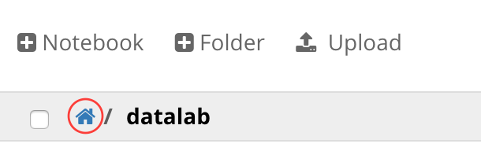
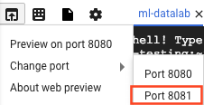

# Google Datalab for Machine Learning Education


## Running Datalab Locally

### With Docker

Follow these steps to set up a local Datalab environment on Mac, Windows, or
Linux using Docker:

**NOTE: If you are using a Chromebook, see [Running Datalab on Google
Cloud](#running-datalab-on-google-cloud) instead for Cloud setup instructions.**

1.  [Install Docker](https://www.docker.com/products/docker) on your computer;
    follow the appropriate instructions and download links for your operating
    system.

2.  Download the [.zip of the latest release of the
    exercises](https://storage.googleapis.com/ml_universities/ml-universities-notebooks-20170410.tar.gz),
    and unzip to the location of your choice.

3.  Open your terminal, and run the following command to launch the datalab
    Docker container.

    **For Mac/Linux**:

    ```
    docker run -it -p "127.0.0.1:8081:8080" -v "${HOME}:/content" \
        gcr.io/cloud-datalab/datalab:local-20170224
    ```

    **For Windows**:

    ```
    docker run -it -p "127.0.0.1:8081:8080" -v "\path\to\exercise_directory:/content" gcr.io/cloud-datalab/datalab:local-20170224
    ```

    NOTE: If you haven't previously run the above command, Docker will output
    the message "Unable to find image locally," and then will proceed to
    download the image.

4.  Load http://localhost:8081/ in your web browser.

5.  You should now have a local Datalab instance running in your browser. Click
    the Home icon to navigate to your home directory:

    

6.  Navigate to the folder with your exercises (the location where you unzipped
    the files in Step #2). Click on an .ipynb exercise to run it.

    Alternatively, you can click the Upload button in the Docker web interface
    and upload the .ipynb files via the filesystem.

## Running Datalab on Google Cloud

### Setting Up For Individual Self-Study Use

Here is how to set up your own Datalab VM running on Google Cloud:

1.  Select existing or create new Google Cloud Project using your favorite
    browser. You must be in the OWNER role to continue.

2.  Start Cloud Shell. Click "Activate Google Cloud Shell" at the top of the
    console window. Click on "Start cloud shell" in the dialog box that opens
    the first time.

    

3.  Create a new Datalab VM in the current Google Cloud Project. From the Cloud
    Shell console, run the following commands:

        git clone https://github.com/google/eng-edu.git
        ./eng-edu/ml/cc/bin/datalab_create.sh

4.  Connect Cloud Shell to a running Datalab VM. From the Cloud Shell console,
    run the following command:

        ./eng-edu/ml/cc/bin/datalab_connect.sh

    If you are asked to set up an SSH key or a passphrase, press enter to stick
    with the defaults.

5.  Wait for the Cloud Shell console message that Datalab VM is ready for use.

    Click on the "Web preview" button of the Cloud Shell window menu (the up
    arrow icon at the top-left), then under "Change port" select port 8081 to
    open a webpage containing the Datalab application.

    

    New browser tab with the Datalab application should open. Click "Accept" to
    accept the terms of service and proceed.

6.  Click on the Notebook button to open a new notebook. In the notebook, in a
    code cell, run the following commands to download and extract the exercises:

        !wget https://storage.googleapis.com/ml_universities/ml-universities-notebooks-20170410.tar.gz \
            -O /content/datalab/notebooks/ml-universities-notebooks-20170410.tar.gz
        !tar -zxvf /content/datalab/notebooks/ml-universities-notebooks-20170410.tar.gz \
            -C /content/datalab/notebooks/

    Then, click on the Google Cloud Datalab logo in the top bar to go back to
    the Datalab homepage. In the Datalab file UI, click on the *datalab* folder
    link, then *notebooks*, and then *ml-exercises*. Then click any of the
    exercise .ipynb links to run a notebook.

7.  You may choose to permanently delete your Datalab VM in the current Google
    Cloud Project after use. There is **no undo** for this operation. The
    Datalab VM, the interactive notebooks and all data will be permanently
    deleted. If you wish to proceed, from the Cloud Shell console, run the
    following command:

        ./eng-edu/ml/cc/bin/datalab_delete.sh

### Setting Up For A Class Use: One Teacher, Multiple Students

Here is how to set up several Datalab VMs running on Google Cloud for access by
your students:

#### As a Teacher

1. Select existing or create new Google Cloud Project using your favorite
  browser. You must be in the OWNER role to continue. All students would need
  a valid Google account to participate.

2. To continue, you can use either Google Cloud Platform Cloud Shell or any
  computer with an Internet connection and the most recent Google Cloud SDK
  [installed] (https://cloud.google.com/sdk/downloads) (gcloud, gsutils).
  To Start Cloud Shell. Click "Activate Google Cloud Shell" at the top of
  the console window. Click on "Start cloud shell" in the dialog box that
  opens the first time.

  

3. Download required shell scripts. From the Cloud Shell console, run the
  following command:

        git clone https://github.com/google/eng-edu.git

  To automate bulk operations with Google Cloud projects and Datalab VMs a
  specialized command-line utility will be used. It can execute numerous
  functions and has many options that control its behaviour. We guide you
  below through the exact options to use. If you want to see all supported
  commands and their options, run one of the following command from the
  Cloud Shell console:

        python ./eng-edu/ml/cc/src/manage.py -h
        python ./eng-edu/ml/cc/src/manage.py projects_create -h
        python ./eng-edu/ml/cc/src/manage.py projects_delete -h

4. Prepare the following:
  * the billing account ID you would like to use to cover the costs of
  running student projects; you can find this information in the Billing
  section of Google Cloud Platform web interface; the value is a series of
  letters and numbers separated by dashes (i.e.`XXXXXX-XXXXXX-XXXXXX`)
  * a space-separated list of student's emails (i.e. `student1.example@gmail.com student2.example@gmail.com`); students will be given a role of EDITOR in their
  respetive projects
  * a space-separated list of owner emails,
  including your email as well as those of Teaching Assistants (i.e.
  `example.teacher@gmail.com example.ta@gmail.com`); owners will be given
  a role of OWNER in all student projects
  * a unique prefix for student project names (i.e. `project-prefix`);
  a portion of student email will be appended to it to create a unique project
  name (i.e. `project-prefix--examplestudent1`)

5. Using information above, format, and run the following command from the Cloud
  Shell console (note to remove a `--dry_run` flag):

        python ./eng-edu/ml/cc/src/manage.py projects_create --billing_id XXXXXX-XXXXXX-XXXXXX --prefix project-prefix --owners "example.teacher@gmail.com example.ta@gmail.com" --students "student1.example@gmail.com student2.example@gmail.com" --dry_run

  Note that `manage.py project_create` command has a number of command-line
  flags that support a varierty of complex deployment scenarious.
  The most notable flags are:
  `--image_name`: to specify a specific version of a Datalab VM base image;
  `--content_bundle`: to deploy a set of notebooks to each Datalab VM;
  `--provision_vm`: to rebuild already provisioned Datalab VM;
  `--zone`: to choose a Google Cloud Platform zone to host your resources.
  Run `python ./eng-edu/ml/cc/src/manage.py projects_create --help` command
  from the console to see a complete list.

6. Review the content of the audit file `account-list-#######.csv`. It contains
  a list of all students along with a Datalab VM project URL for each project
  created.

7. Send the appropriate Datalab VM project URL to each student. Invite each
  student to visit allocated project URL and follow the instructions in the
  next section. Projects can't be shared or exchanged between students.

8. You may choose to permanently delete all projects after the class ends.
  There is **no undo** for this operation. All student projects, Datalab VMs
  and data will be permanently deleted. If you wish to proceed, from the Cloud
  Shell console, run the following command (note to remove a `--dry_run` flag):

        python ./eng-edu/ml/cc/src/manage.py projects_delete --prefix project-prefix --students "student1.example@gmail.com student2.example@gmail.com" --dry_run

#### As a Student

1.  Wait for a Teacher to inform your that your Datalab VM project is ready.

2.  Using your favorite browser, navigate to a Google Cloud Project URL provided
    to you by a teacher.

3.  Start Cloud Shell. Click "Activate Google Cloud Shell" at the top of the
    console window. Click on "Start cloud shell" in the dialog box that opens
    the first time.

    

4.  Connect Cloud Shell to a running Datalab VM. From the Cloud Shell console,
    run the following command:

        git clone https://github.com/google/eng-edu.git
        ./eng-edu/ml/cc/bin/datalab_connect.sh

    If you are asked to set up an SSH key or a passphrase, press enter to stick
    with the defaults.

5.  Wait for the Cloud Shell console message that Datalab is ready for use.

    Click on the "Web preview" button of the Cloud Shell window menu (the up
    arrow icon at the top-left), then under "Change port" select port 8081 to
    open a webpage containing the Datalab application.

    

    New browser tab with the Datalab application should open. Click "Accept" to
    accept the terms of service and proceed.

6.  Click on the Notebook button to open a new notebook. In the notebook, in a
    code cell, run the following commands to download and extract the exercises:

        !wget https://storage.googleapis.com/ml_universities/ml-universities-notebooks-20170410.tar.gz \
            -O /content/datalab/notebooks/ml-universities-notebooks-20170410.tar.gz
        !tar -zxvf /content/datalab/notebooks/ml-universities-notebooks-20170410.tar.gz \
            -C /content/datalab/notebooks/

    Then, click on the Google Cloud Datalab logo in the top bar to go back to
    the Datalab homepage. In the Datalab file UI, click on the *datalab* folder
    link, then *notebooks*, and then *ml-exercises*. Then click any of the
    exercise .ipynb links to run a notebook.

7.  Click on the Notebook button to open a new notebook. Setup is now complete.
    You can start writing and executing code.

### Setting Up For Notebook Development and Testing

Here is how to set up your own Datalab VM running on Google Cloud and then
develop and test interactive Jupyter notebooks:

1. Select existing or create new Google Cloud Project using your favorite
  browser. You must be in the OWNER role to continue.

2. To continue, you can use either Google Cloud Platform Cloud Shell or any
  computer with an Internet connection and the most recent Google Cloud SDK
  [installed] (https://cloud.google.com/sdk/downloads) (gcloud, gsutils).
  To Start Cloud Shell. Click "Activate Google Cloud Shell" at the top of
  the console window. Click on "Start cloud shell" in the dialog box that
  opens the first time.

  

3. Download required shell scripts. From the Cloud Shell console, run the
  following command:

        git clone https://github.com/google/eng-edu.git

  To automate bulk deployment and testing of notebooks with Google Cloud
  projects and Datalab VMs a specialized command-line utility will be used. It
  can execute numerous functions and has many options that control its
  behaviour. We guide you below through the exact options to use. If you want
  to see all supported commands and their options, run one of the following
  command from the Cloud Shell console:

        python ./eng-edu/ml/cc/src/manage.py -h
        python ./eng-edu/ml/cc/src/manage.py datalab_create -h
        python ./eng-edu/ml/cc/src/manage.py datalab_delete -h

4. Prepare a set of Jupyter notebooks using your local development environment.
  Package the notebooks into a content bundle: a `content_bundle.tar.gz` file.

5. Create a new Datalab VM in the current Google Cloud Project, deploy the
  content bundle and test all notebooks it contains. From the Cloud Shell
  console, run the following commands:

        python ./eng-edu/ml/cc/src/manage.py datalab_create --content_bundle content_bundle.tar.gz --validate_content_bundle

6. Once the command completes, review the log messages printed to the console.
  The log will show the number of executed, passed and failed notebooks. It will
  also show the exact file names containing execution log
  (`remote-log-mlccvm-<HOST_NAME>-#######.txt`) and the content of
  executed notebooks (`bundle-test--#######.json`).

7. The content bundle can be placed onto Google Cloud storage, and used
  directly from there, for example:

        python ./eng-edu/ml/cc/src/manage.py datalab_create --content_bundle gs://my_bucket/content_bundle.tar.gz --validate_content_bundle

  If you have a large number of notebooks and testing takes a while, you can
  add more virtual CPUs to a Datalab VM to reduce the execution time.

  You can execute this command multiple times. If Datalab VM already exists, it
  will not be reprovisioned (unless `--provision_vm` is specified), but the
  content bundle will be redeployed and retested.

8. You may connect to the Datalab VM and execute notebooks in the deployed
  content bundle manually. This is only possible from the Cloud Shell and will
  not work from you local development workstation. From the Cloud Shell
  console, run the following commands:

        python ./eng-edu/ml/cc/src/manage.py datalab_connect

9. You may choose to permanently delete your Datalab VM in the current Google
  Cloud Project after use. There is **no undo** for this operation. The Datalab
  VM, the interactive notebooks and all data will be permanently deleted. If
  you wish to proceed, from the Cloud Shell console, run the following command:

        python ./eng-edu/ml/cc/src/manage.py datalab_delete


### Troubleshooting

* **Symptom**: Everything was working fine, but then the connection to Cloud
  Shell was lost because I either closed my browser window or Cloud Shell has
  timed out.

  **Resolution**: To restart the Datalab VM, reopen the Cloud Shell window as
  described above. From the Cloud Shell console, run the following command:

        ./eng-edu/ml/cc/bin/datalab_connect.sh
